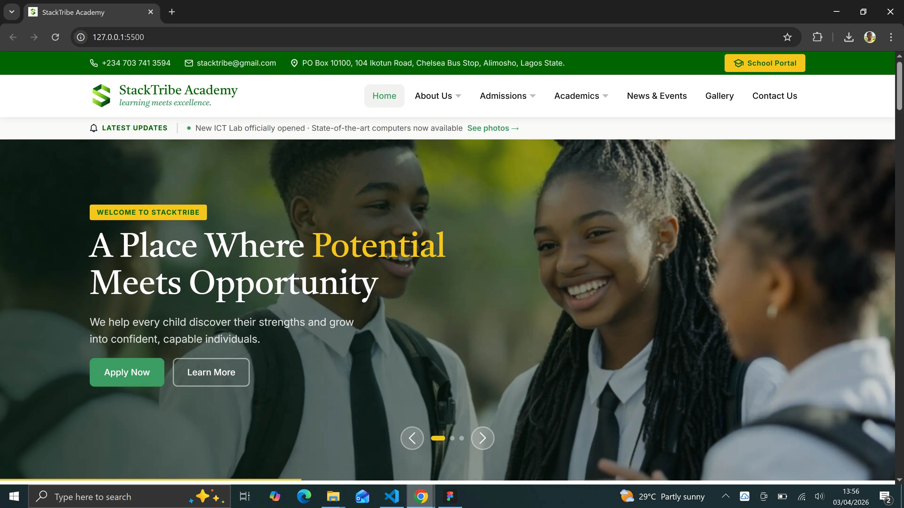

# StackTribe Academy 📚

Introducing StackTribe Academy Website.
The idea is to build a digital solution for Nigerian Private Schools; to enable parents access their children results, make secure payments, and manage school activities — all in one place.

Core Features:
📊 Instant Result Access 
💳 Secure Fee Payments 
🏫 Centralized School Portal 

## Deployment

Demo: https://damistacks.github.io/stacktribe-academy-demo/



## Built With

- HTML
- CSS
- Media Query
- JavaScript

## Project Layout

```
stacktribe-academy-demo/
├── assets/
│   ├── icons/           ← Icons
│   └── images/          ← Images
├── index.html        ← Homepage HTML
├── style.css         ← CSS Styles
├── mediaqueries.css  ← MediaQueries Styles
├── script.js         ← JavaScript
```

## Author

- **Oluwasegun Idowu**
  [damistacks](https://github.com/damistacks/)

## License


STACKTRIBE ACADEMY WEBSITE - CUSTOM EDUCATIONAL USE LICENSE  
Copyright (c) 2026 Oluwasegun Idowu. All Rights Reserved.

IMPORTANT - PLEASE READ CAREFULLY BEFORE USING THIS SOFTWARE.

This software, StackTribe Academy Website, is a demo for a web-based 
school management platform concept developed strictly for educational,
portfolio, and demonstration purposes. It is designed to showcase
a digital solution for Nigerian private schools, including features
such as student result access, fee payments, and school activity
management.

THIS APPLICATION IS NOT A PRODUCTION-READY SYSTEM AND MUST NOT BE USED
TO HANDLE REAL STUDENT DATA, FINANCIAL TRANSACTIONS, OR SENSITIVE
INFORMATION.

--------------------------------------------------------------------
PERMITTED USES
--------------------------------------------------------------------

You MAY:

  - View and study the source code for personal learning purposes.
  - Fork or clone the repository solely for educational exploration.
  - Use the project as a reference for building similar systems,
    provided clear and visible credit is given to the original author.
  - Showcase or reference this project in portfolios, presentations,
    or academic work with proper attribution.

--------------------------------------------------------------------
PROHIBITED USES
--------------------------------------------------------------------

You MAY NOT, under any circumstances:

  - Use, modify, or deploy this software - in whole or in part - to
    collect, store, process, or transmit real student records,
    financial data, payment information, or personally identifiable data.
  - Present this software as a fully functional or production-ready
    school management system for real-world use.
  - Use this project to mislead schools, parents, or institutions
    into believing it is a secure or certified platform.
  - Sell, sublicense, or commercially distribute this software or any
    derivative without the express written permission of the author.
  - Use this software in any way that violates data protection laws,
    educational regulations, or cybersecurity policies.

--------------------------------------------------------------------
DISCLAIMER
--------------------------------------------------------------------

THIS SOFTWARE IS PROVIDED FOR EDUCATIONAL AND DEMONSTRATION PURPOSES
ONLY, "AS IS", WITHOUT WARRANTY OF ANY KIND.

THE AUTHOR MAKES NO GUARANTEES REGARDING SECURITY, DATA PROTECTION,
OR SUITABILITY FOR REAL-WORLD DEPLOYMENT AND ACCEPTS NO LIABILITY FOR
ANY MISUSE, DAMAGE, DATA BREACH, FINANCIAL LOSS, OR LEGAL CONSEQUENCE
ARISING FROM THE USE OR MISUSE OF THIS SOFTWARE.

ANY ATTEMPT TO USE THIS SOFTWARE FOR FRAUDULENT ACTIVITIES, DATA THEFT,
OR MISREPRESENTATION IS STRICTLY PROHIBITED AND MAY RESULT IN LEGAL
ACTION.

--------------------------------------------------------------------
ATTRIBUTION
--------------------------------------------------------------------

Any permitted use of this software must retain this license notice in
full and visibly credit the original author:

  Oluwasegun Idowu - https://github.com/damistacks

By accessing, cloning, or using any part of this repository, you
acknowledge that you have read, understood, and agree to be bound by
the terms of this license.
